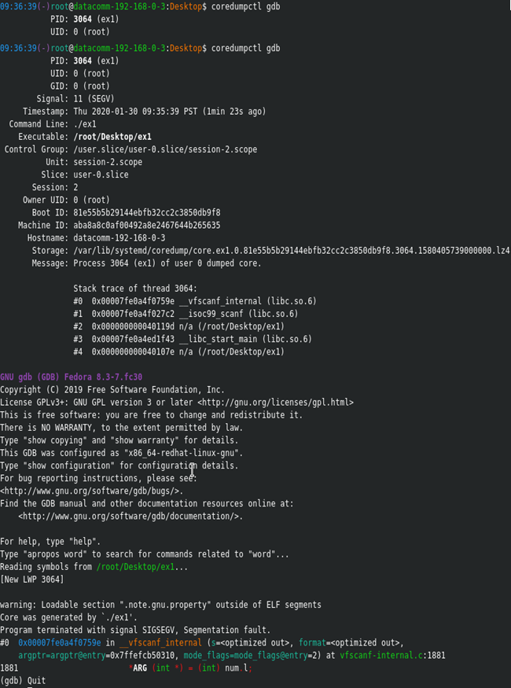
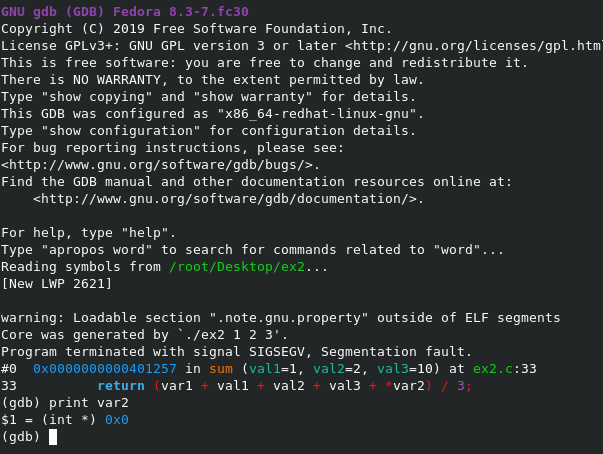
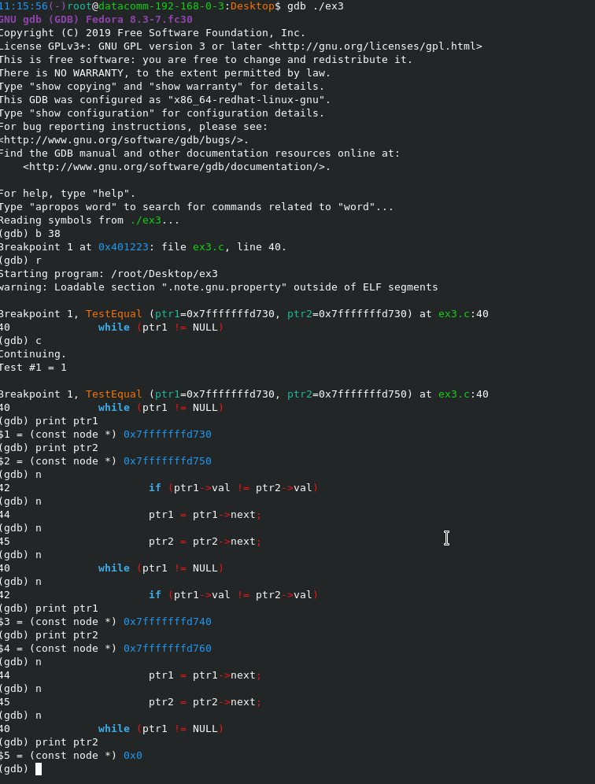

# GNU-Debugger-Examples
A tutorial showing the use of GNU Debugger (GDB) to help navigate finding and resolving code issues. The examples, though trivial and perhaps easily discoverable by the reader, serve to just show how to use GDB to help find issues faster.

The examples with issues in them are ex1.c, ex2.c and ex3.c. The code for the examples was sourced from Aman Abdulla, and the fixes with explanations are provided by myself.

## Example 1 ##
__Code reference:__ ex1.c

Intent of the code: The code is asking the user to enter an integer from 0-9,999. From there, the code tests whether the input was an int. The code does this by first creating an int array from 0-9,999 which stores a value that matches its index. If the user inputs an int, then the value will correspond to the provided integer, if not, the output will yield non-matching numbers.

__The issue__: When trying to run this code, the compiler gives a “segmentation fault (core dumped)” error.

__Finding the issue__: 

1.	Run “ulimit -c” and ensure that the value is unlimited, if it is 0, set this to “ulimit -c unlimited” in order to make sure you can collect the core dump.
2.	Compile the code with debugging flags on (gcc -Wall -g -o ex1 ex1.c)
3.	Try running the code to create a core dump
4.	Execute “coredumpctl gdb” which will open the last created core
5.	Looking at the core, you can tell that the issue is with the scanf API call (library line 1881). I can run the code with debugger using “gdb ./ex1” to find the exact line in main where this is called, but since there is only 1 scanf call, I know where the issue is.

__Issue resolution:__

1.	The line is “scanf(“%d”, k);” where k is an int
2.	Run a “man scanf” to see if this is using the API properly
3.	On reading the man page, it becomes clear that the scanf requires a pointer to do a conversion, and in fact cannot receive an int variable.
4.	Change the scanf call to pass it the address of k instead (“scanf(“%d”, &k);”
5.	Re-compiling and running the program shows that it now works.

## Example 2 ##

__Code reference:__ ex2.c

Intent of the code: The code requires that a user enter 3 integer command line arguments. When done, the code converts the input to string using the atoi API, and adds it using a unique adding pattern. An example of the adding pattern correctly would be inputting “./ex2 1 2 3” and having the output yield “35”.

__The issue:__ When trying to run this code, the compiler gives a “segmentation fault (core dumped)” error.

__Finding the issue:__

1.	Run “ulimit -c” and ensure that the value is unlimited, if it is 0, set this to “ulimit -c unlimited” in order to make sure you can collect the core dump.
2.	Compile the code with debugging flags on (gcc -Wall -g -o ex2 ex2.c)
3.	Try running the code to create a core dump
4.	Execute “coredumpctl gdb” which will open the last created core
5.	The core tells you that there was an issue on line 33 with the return statement which adds the variables in its unique adding pattern. As a note, you can also run gdb line by line by using the --args flag (ex gdb --args ex2 intarg1 intarg2 intarg3)
6.	As this is a memory leak, we can try printing out the addresses of the variables passed. When doing so, we see that var2 has a memory address of 0x0, which indicates that it is trying to dereference and add a null pointer, which will of course crash the program. 

__Issue resolution:__

1.	The intended use case of the original code: “int * var2 = 0” seems to indicate the user wanted to add 0.
2.	To keep the addition of 0, the user should change the pointer to just an int of 0.

## Example 3 ##
__Code reference:__ ex3.c

__Intent of the code:__ The code creates an array of 100 node structs, and assigns the first 3 nodes to have the next node be the node next in the array. 

	nodes[0].next = &nodes[1];
	nodes[1].next = &nodes[2];
	nodes[2].next = &nodes[3];

The code wants to create a method which checks for value equality of nodes. It should return 1 if the node chains are equal, and 0 if not.

__The issue:__ When trying to run this code, the compiler gives a “segmentation fault (core dumped)” error after printing out the first comparison (which runs successfully as intended). The second test, which checks value equality with nodes starting at different location does not pass and has the seg fault.

__Finding the issue:__

1.	Run “ulimit -c” and ensure that the value is unlimited, if it is 0, set this to “ulimit -c unlimited” in order to make sure you can collect the core dump.
2.	Compile the code with debugging flags on (gcc -Wall -g -o ex3 ex3.c)
3.	Try running the code to create a core dump
4.	Since we actually want to step through the code, we’ll run “gdb ./ex3” this time
5.	Set a breakpoint at the entrance to the test function “TestEqual”
6.	Run the program through gdb by entering “r”
7.	It has stopped at the entrance to the first test, press “c” to continue the debugger, you should see the debugger print out that test 1 passes. “Test #1 = 1”
8.	As this is a segmentation fault, we want to print the values of “ptr1” and “ptr2” throughout the code to see if we have a 0x0 memory address.
9.	Press n to iterate through the while loop once, then check the values. Do this until you notice the loop enters while ptr2 is null.

__Issue resolution:__

1.	Make a guard which checks whether “ptr2” is null, then return 0 (test failed) when entering the loop each time.

